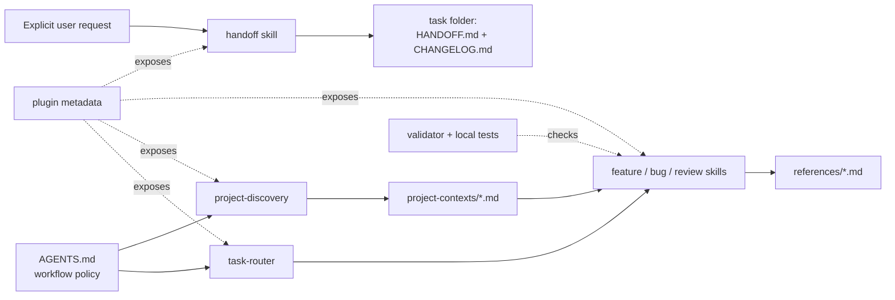
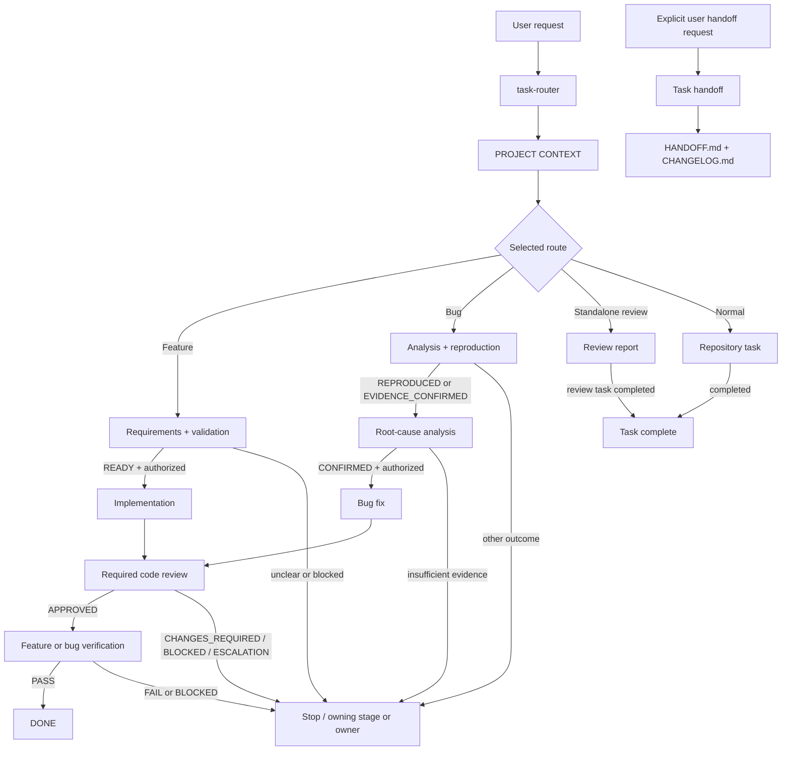

# PROJECT CONTEXT

- Target: `/Users/pro14inch/Desktop/Code/skills/agent_skills` (Git repository containing the `agent-skills/` package).
- Saved path: `agent-skills/project-contexts/agent-skills.md`.
- Revision: pc9.
- Status: CURRENT for repository-level architecture; the Git baseline is a point-in-time observation.
- Selected route / scope: Improve project-discovery, handoff, requirement-validator, code-review, and fix-code-review after their below-8 evaluation.
- Repository baseline observation: Git root at target path, branch `main`. At the start of pc9 refresh, HEAD was `5328fd63bf339e2ab001e14ec4b0204991ae0d97` and the worktree was clean. The current skill changes make the worktree dirty; recheck HEAD and worktree state before reusing check or review evidence. This snapshot does not claim that Git state remains unchanged.
- Sources: `AGENTS.md`, `agent-skills/AGENTS.md`, `agent-skills/skills/README.md`, `agent-skills/skills/task-router/SKILL.md`, `agent-skills/skills/project-discovery/SKILL.md`, representative feature/bug/review skills, package manifests, validator and evaluation source listed below.
- Freshness basis: Directly inspected the named files and Git status at pc1 creation; refreshed pc2–pc8 for the changes recorded in those revisions and pc9 for five skill contracts plus targeted evaluation wiring. Recheck governing instructions, manifests, changed skill files, and worktree status before reusing affected facts. A new commit by itself does not invalidate unchanged architecture facts.
- Prior revision / changes: pc8 recorded removal of the last saved handoff. pc9 records stronger baseline freshness, self-contained handoff evidence, partial-answer validation, repeatable fresh review, and carried review blockers.

## Repository Topology

```text
agent_skills/                         # Git workspace
├── AGENTS.md                         # root workflow instructions
├── .agents/                          # root plugin marketplace
├── .codex/                           # root plugin enablement
└── agent-skills/                     # distributable package
    ├── AGENTS.md                     # package workflow instructions
    ├── .codex-plugin/                # package manifest
    ├── .agents/  .codex/             # package marketplace and enablement
    ├── project-contexts/            # saved repository maps
    └── skills/
        ├── task-router/             # route selection
        ├── project-discovery/       # repository map
        ├── handoff/                 # task context reset
        ├── feature-workflow/        # feature stages
        ├── bug-workflow/            # bug stages
        ├── code-review-workflow/    # review stages
        ├── references/             # shared evidence guidance
        ├── scripts/                # package validation
        └── evals/                  # decision probes and local tests
```

- Boundaries / excluded areas: One Git repository; no nested `.git` directory was found in the inspected tree. `.git/` internals and historical evaluation result bodies are outside this context's scope. No generated, vendor, or application build tree was observed in the relevant file listing.
- Tree evidence: `AGENTS.md`, `agent-skills/skills/README.md` layout, package manifests, and the inspected file listing under `agent-skills/`. The `handoffs/` directory is currently absent; the handoff skill creates a task folder there when explicitly requested.

## Governing Instructions

- `AGENTS.md`: applies when the repository root is the workspace. Route each new top-level request; run discovery for repository-dependent work; preserve unrelated work; use stage contracts and review/verification gates; validate authorized skill-system maintenance.
- `agent-skills/AGENTS.md`: equivalent package-level workflow for a workspace using the cloned `agent-skills/` directory. It directs PROJECT CONTEXT snapshots to `project-contexts/`, user-requested task handoffs to `handoffs/`, and other artifacts to the conversation by default.
- `agent-skills/skills/project-discovery/SKILL.md`: discovery may write only its context Markdown file, uses repository evidence, refreshes material facts, distinguishes a CURRENT architecture map from its point-in-time Git observation, and reports unavailable persistence.
- `agent-skills/skills/handoff/SKILL.md` and `agents/openai.yaml`: only an explicit user request invokes handoff; it creates the parent directory if needed, writes a handoff and changelog under `<taskID>-<description>/`, and keeps its own content manifest. An unfinished checkpoint remains labeled CHECKPOINT.

## Technology and Tooling

- Languages/runtimes: Markdown is the primary workflow format; Bash scripts provide validation and verification helpers; Python 3 scripts provide native-package validation and behavioral evaluation (`skills/scripts/`, `skills/evals/`).
- Frameworks/platforms: Codex plugin packaging via `.codex-plugin/plugin.json`, `.agents/plugins/marketplace.json`, and `.codex/config.toml`; no application framework is declared in inspected manifests.
- Package/workspace/build tools: Git; Bash; Python 3 standard library (`json`, `tomllib`, `unittest`, `subprocess`, etc. in inspected scripts). No application package manager or build manifest was found in the relevant repository listing.
- Infrastructure/storage/external systems: Markdown files and Git provide persistent project data. The optional behavioral runner invokes a local `codex` command in an ephemeral work directory; live client/plugin discovery is outside repository-only evidence.

## Structure and Responsibilities

| Path / component | Responsibility and boundary | Evidence |
| --- | --- | --- |
| `skills/task-router/` | Selects one route; stops before downstream work | `task-router/SKILL.md` |
| `skills/project-discovery/` and `project-contexts/` | Creates and stores versioned repository maps | `project-discovery/SKILL.md`, template |
| `skills/handoff/` and `handoffs/` | On explicit user request, captures a completed task or unfinished checkpoint as two files per `<taskID>-<description>/` folder | `handoff/SKILL.md`, `agents/openai.yaml` |
| `skills/feature-workflow/`, `bug-workflow/`, `code-review-workflow/` | Stage contracts, gates, report templates, and required-gate independent review packet guide | Representative `SKILL.md` files; `code-review/references/independent-review.md`; `agent-skills/AGENTS.md` |
| `skills/references/check-evidence.md` | Shared executed-check provenance | `check-evidence.md` |
| `skills/scripts/` and `skills/feature-workflow/verification/scripts/` | Package validation and focused verification helpers | `validate-skill-system.sh`, `verify.sh` |
| `skills/evals/` | Scenario packets, unit tests, and measured decision probes | `build_packet.py`, `run_behavioral_eval.py` |

## Architecture and Flows

Component relationships (arrows show documented references or inputs, not measured runtime calls):



- Architecture / dependency evidence: `agent-skills/AGENTS.md`, `.codex-plugin/plugin.json`, `skills/task-router/SKILL.md`, `skills/project-discovery/SKILL.md`, `skills/handoff/SKILL.md`, and `skills/scripts/validate_native_package.py`.
- Style / boundary notes: File-based contract and handoff workflow. Skills define stage outcomes; linked templates define artifact fields. The plugin manifest exposes skill roots; validator and evaluation scripts inspect package files.

Task flow (repository-dependent path; arrows state the required advancement status):



- Workflow / data-flow evidence: `agent-skills/AGENTS.md` workflow diagrams and artifact rules, `skills/feature-workflow/requirement-validator/SKILL.md`, `skills/bug-workflow/bug-reproduction/SKILL.md`, `skills/bug-workflow/bug-root-cause/SKILL.md`, `skills/code-review-workflow/code-review/SKILL.md`, and `skills/handoff/SKILL.md`. Stop outcomes retain their owner and resume conditions; FAIL returns through its owning stage and review. An explicit unfinished handoff records CHECKPOINT and open items rather than DONE.
- Text fallback: The router selects a route and repository work uses PROJECT CONTEXT. Feature implementation needs READY and authority; bug fixing needs confirming reproduction evidence, a confirmed cause, and authority. Feature/bug changes need APPROVED review and verification PASS before DONE. Handoff runs only on explicit user request.
- Evaluation flow: Separately, `build_packet.py` selects allowlisted skill/scenario files, including the required-gate review guide only for E11 and handoff resources for E16; `run_behavioral_eval.py` sends the packet to `codex exec` and records trace-derived results.

## Project Notes and Edge Cases

- Notes: The root and package `AGENTS.md` files have distinct path bases; edit both when shared instructions change. Skill-system maintenance requires updating `skills/CHANGELOG.md` and running the structural validator (`AGENTS.md`, `agent-skills/AGENTS.md`).
- Notes: PROJECT CONTEXT is the persistent exception to the package's conversation-only artifact default. Refresh only materially affected facts and keep the saved path in discovery handoff (`project-discovery/SKILL.md`).
- Notes: User-requested task handoffs are the other persistent artifact exception. A fresh session reads the handoff, its task changelog, PROJECT CONTEXT, and current instructions, then checks content fingerprints and baseline freshness before reusing evidence (`handoff/SKILL.md`).
- Edge cases: A dirty worktree can invalidate prior review or check evidence even when HEAD is unchanged. Preserve unrelated changes and identify the actual content baseline (`AGENTS.md`, `skills/references/check-evidence.md`).
- Edge cases: Read-only review cannot fix findings without explicit fix authority; required approval needs a fresh reviewer context. Verification cannot claim PASS from missing required evidence, and repeated blocking review or verification failures have stop limits (`agent-skills/AGENTS.md`, `code-review/SKILL.md`).
- Edge cases: `verify.sh` prints changed files and related test candidates, but runs a check only when arguments follow `--`; name-matched tests are candidates, not complete coverage (`verification/scripts/verify.sh`, `related-tests.sh`).
- Edge cases: The structural validator can pass without proving live client discovery or application behavior (`skills/README.md`, `validate-skill-system.sh`). The evaluation runner labels isolation unverified even though it uses an ephemeral read-only working directory (`evals/run_behavioral_eval.py`).
- Unverified assumptions: Whether this client currently discovers the edited local plugin is not established by repository files; confirm in the target client if discovery behavior becomes relevant. No application runtime behavior was exercised during this read-only inspection.

## Entry Points and Interfaces

- `AGENTS.md` and `agent-skills/AGENTS.md`: workspace instruction entry points.
- `agent-skills/.codex-plugin/plugin.json`: plugin manifest; lists skill roots. `.agents/plugins/marketplace.json` and `.codex/config.toml` provide package-local marketplace and enablement.
- `agent-skills/skills/*/SKILL.md`: stage contracts loaded for the selected route; `references/*.md` are output schemas.
- `agent-skills/skills/scripts/validate-skill-system.sh`: structural validation command, defaulting to the `agent-skills/` package root.
- `agent-skills/skills/evals/build_packet.py` and `run_behavioral_eval.py`: packet builder and optional measured decision-probe CLI.

## Commands and Conventions

- Build/run: No application build or server run command is documented. The package is used by opening a workspace with its `AGENTS.md` or explicitly supplying it (`skills/README.md`).
- Test: From the package root, `python3 -m unittest discover -s skills/evals -p 'test_*.py'` is documented for local regression tests (`skills/README.md`).
- Lint/typecheck/static: From this workspace root, `bash agent-skills/skills/scripts/validate-skill-system.sh`; the script checks Markdown links and contract markers, Bash syntax, and native plugin coverage (`AGENTS.md`, validator source). No separate lint or typecheck command was found in inspected docs.
- Conventions: Skills have constrained YAML frontmatter, required `Walk It Down` Start/Expand/Stop fields, and linked templates; status and revision fields carry stage decisions (`validate-skill-system.sh`, `skills/README.md`).
- Command status: Initial discovery used read-only inspection commands (`git`, `rg`, `find`, `cat`, `sed`) and ran no tests. Earlier handoff-skill maintenance ran the structural validator and local unit tests, but its saved task handoffs and source manifest were removed at the user's request; those historical results are UNKNOWN for reuse. No application or behavioral probe was run for discovery.

## Task-Relevant Map

- Current request: Improve the five skills previously scored below 8 and test their affected decisions.

## Risks and Unknowns

- R1: No saved task handoff currently exists. Historical review and check results formerly summarized in removed artifacts cannot be independently reused. A future reader must compare current Git content and executed evidence before relying on those results.
- U1: Live Codex discovery of this edited local package was not checked. This does not block repository-level context; it matters only for a native-client integration claim.
- U2: No application runtime exists in inspected manifests/docs, and no full behavioral evaluation was run. This does not block repository-level context; structural and behavioral claims need their respective checks.

## Handoff

- Context disposition: CURRENT for this repository's workflow/package architecture; refresh only affected facts after relevant edits.
- Next stage / owner: The current five-skill improvement task may use pc9. Future repository-dependent work may reuse pc9 after a freshness check.
- Required refresh triggers: Changed governing instructions, plugin manifests, stage contracts, templates, validator/evaluation architecture, or another change affecting a fact cited here. A different commit alone is insufficient.
- Remaining action: None for discovery; live client discovery and behavior checks remain separate if later requested.
