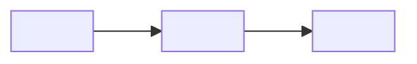

# PROJECT CONTEXT

- Target: <absolute or workspace-relative repository/workspace identity>
- Saved path: <agent-skills/project-contexts/repository-name.md, or unsaved with reason>
- Revision: <pc1; increment for material context changes>
- Status: <CURRENT / PARTIAL / BLOCKED for the evidenced repository map, not a claim that Git state is still current>
- Selected route / scope: <route and repository-dependent purpose>
- Repository baseline observation: <when observed; Git root(s), branch/commit or non-Git identity, worktree state; recheck before reusing execution evidence>
- Sources: <instructions, manifests, docs, entry points, representative source paths>
- Freshness basis: <relevant source paths, baseline/content fingerprints, dirty/untracked state>
- Prior revision / changes: <initial or material reason for refresh>

## Repository Topology

Show only relevant directories and entry points as a compact tree; annotate roles rather
than copying a full file listing.

```text
repository/
├── <entry point or module>/    # <role>
└── <tests or package>/         # <role>
```

- Boundaries / excluded areas: <nested repositories, generated/vendor/build/unrelated roots and reason>
- Tree evidence: <paths or manifest references used to build the tree>

## Governing Instructions

- <path or runtime source>: <scope and material rules for downstream work>

## Technology and Tooling

- Languages/runtimes: <evidence>
- Frameworks/platforms: <evidence>
- Package/workspace/build tools: <evidence>
- Infrastructure/storage/external systems: <evidence or unknown>

## Structure and Responsibilities

| Path / component | Responsibility and public boundary | Evidence |
| --- | --- | --- |
| <path/module> | <concise role> | <source path/symbol> |

## Architecture and Flows

Use one small Mermaid diagram for meaningful component/dependency relationships. Show
direction explicitly; omit it for a simple single-component project. Replace the
placeholder labels with evidenced components and cite the supporting paths below it.



- Architecture / dependency evidence: <path or symbol supporting each material edge>
- Style / boundary notes: <only non-obvious responsibilities, ownership, or constraints>

Use a separate flowchart for an important request, build, or data workflow when its
sequence or branching matters. A short ordered list is sufficient for a linear path.

```mermaid
flowchart TD
  Input["<input>"] --> Step["<processing step>"]
  Step --> Result["<output or persisted state>"]
```



- Workflow / data-flow evidence: <entry point, transformation, persistence or external boundary>
- Text fallback: <one sentence for readers whose Markdown renderer does not show Mermaid>

## Project Notes and Edge Cases

- Notes: <non-obvious conventions or decisions relevant to future work; evidence>
- Edge cases: <observed boundary conditions, failure paths, or documented constraints; evidence>
- Unverified assumptions: <question and evidence needed; never present as established behavior>

## Entry Points and Interfaces

- <path/symbol/interface>: <role and consumers>

## Commands and Conventions

- Build/run: <observed command and source, or unknown>
- Test: <observed command and source, or unknown>
- Lint/typecheck/static/security: <observed command and source, or unknown>
- Conventions: <naming, layout, generated-code, migration, or test patterns with evidence>
- Command status: <discovered only; identify any read-only command actually executed>

## Task-Relevant Map

- <selected route concern>: <likely component and why; defer detailed task analysis>

## Risks and Unknowns

- R1: <risk, evidence, downstream impact>
- U1: <unknown, searches/evidence checked, whether it blocks the selected route>

## Handoff

- Context disposition: <reuse / refresh condition / stop reason>
- Next stage / owner: <selected feature, bug, review, or repository-dependent NORMAL work>
- Required refresh triggers: <target, instructions, manifest, baseline, or architecture change>
- Remaining action: <none or exact owner/action/resume condition>

Emit only task-relevant sections and visuals; remove unused placeholder diagrams and
group unrelated fields as out of scope. Keep labels short and visuals readable at a
glance; use a table or concise text when a diagram would add clutter. On refresh,
cite the accessible prior revision and changed facts; supply the full snapshot when
that prior revision is unavailable. Cite paths, symbols, and stable evidence IDs rather
than copied source. A different commit alone does not invalidate unchanged facts.
